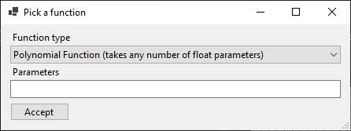
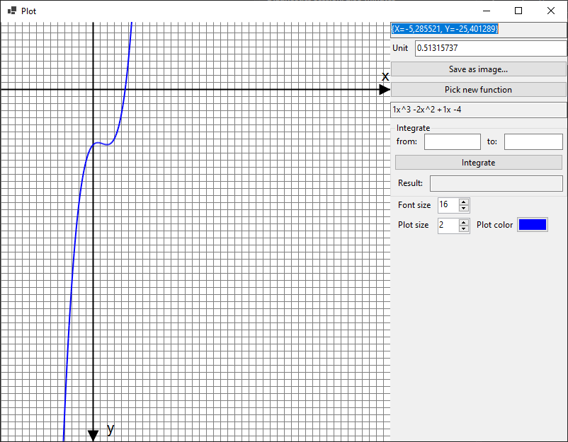

# Plot and Integrate

Windows Forms practice application that can be used for drawing simple plots and calculating integrals.

# Installation

# Option 1

You can download a release from "Releases" section (under the "Assets" dropdown) where you can find `Plot.zip` file.
You can simply download the file, unpack it somewhere and use the `PlotAndIntegrate.exe` to launch the application or `setup.exe` to install it.

# Option 2

After cloning the project or dowloading and unpacking zip file with source, you can compile the solution with your IDE (I used Visual Studio 2019 for this project).
Resulting files will appear in `PlotAndIntegrate\bin\` directory.

# Usage

Launch the compiled project from IDE or directly from output directory.
It will show a predefined plot, that can be panned with mouse while mouse button is pressed, or zoomed by scrolling the mouse wheel.
Scrolling will change the Unit value presented below the plot. Just under the plot you can find coordinate values under mouse cursor position.
Plot can be saved as a PNG image using `Save as image...` button.

Below it, users can find `Pick a function` button which shows a new Form where a different function can be picked.
Currently there are only logarithmic and polynomial functions.
Users can see the function's formula directly under this button.

Dialog for picking a function looks like this:

Another option available is calculating the definite integral for a given range.
There are also settings for fontsize of axes' labels, plot width and plot color.

Plot can be double-clicked which causes it to take whole form space and makes options section move to the right.

