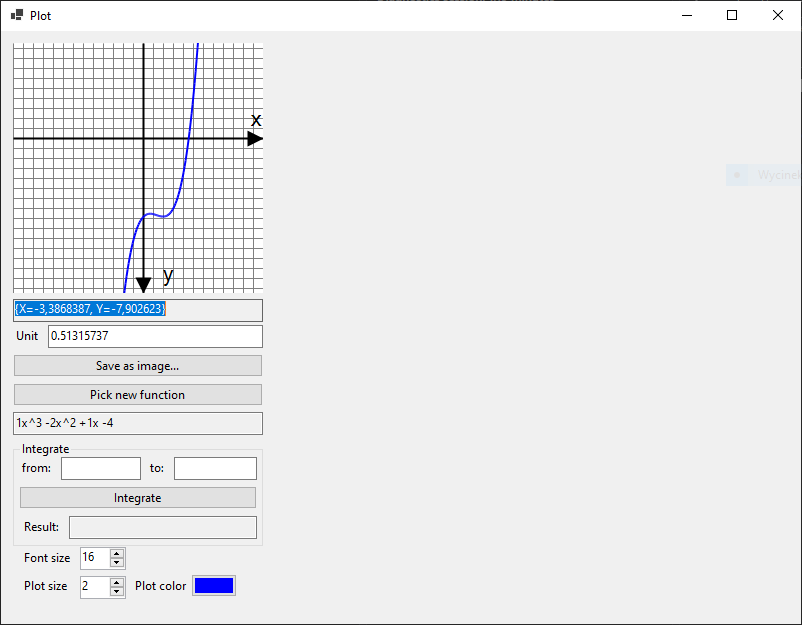

# Plot and Integrate

Windows Forms practice application that can be used for drawing simple plots and calculating integrals.

# Installation

After cloning the project or dowloading and unpacking zip file, you can compile the solution with your IDE (I used Visual Studio 2019 for this project).
Resulting files will appear in `PlotAndIntegrate\bin\` directory.

# Usage

Launch the compiled project from IDE or directly from output directory.
It will show a predefined plot, that can be panned with mouse while mouse button is pressed, or zoomed by scrolling the mouse wheel.
Scrolling will change the Unit value presented below the plot. Just under the plot you can find coordinate values under mouse cursor position.
Plot can be saved as a PNG image using `Save as image...` button.

Below it, user can find `Pick a function` button which shows a new Form where a different function can be picked.
Currently there are only logarithmic and polynomial functions.
User can see the function's formula directly under this button.

On the right side, there are settings for fontsize, plot width and plot color.
The last option available is calculating the integral for a given range on the bottom of the form.
